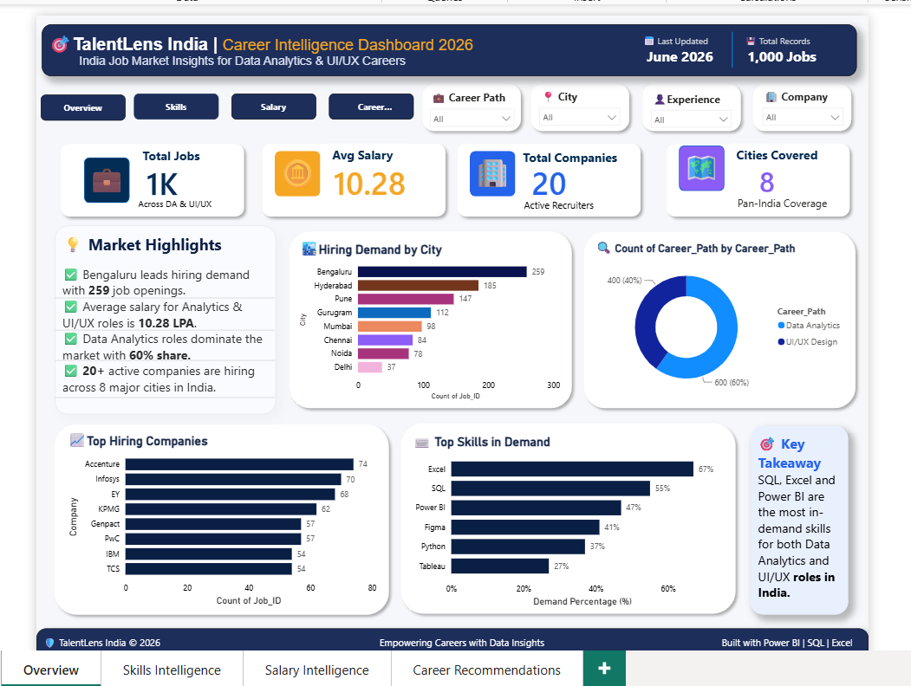
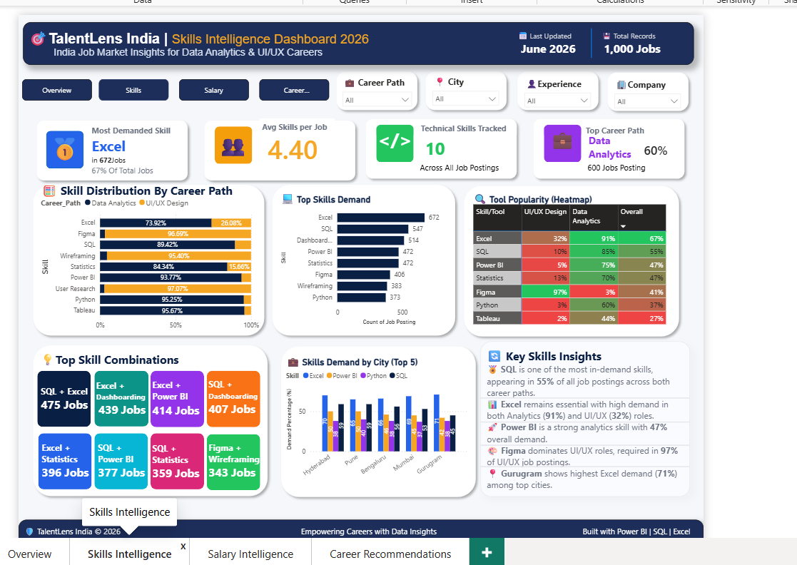
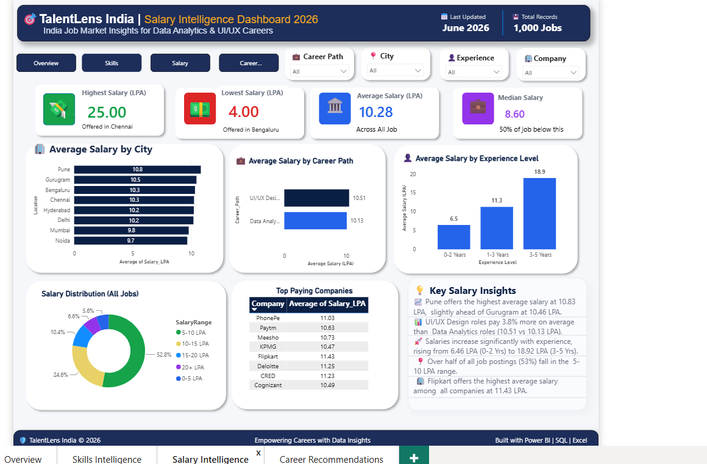
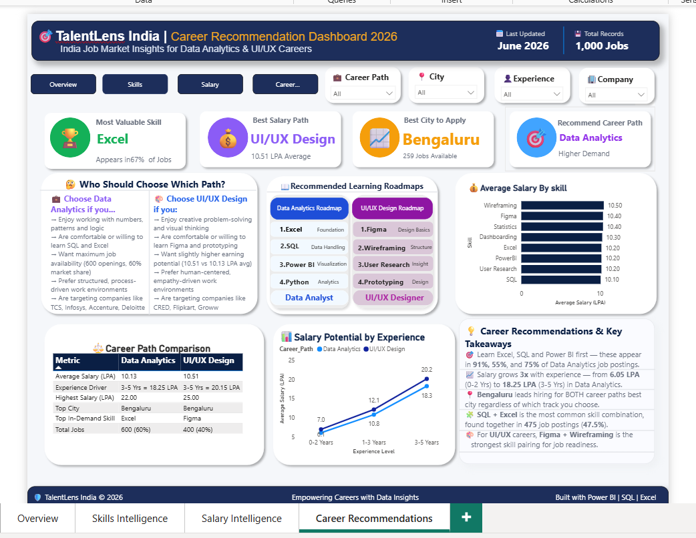
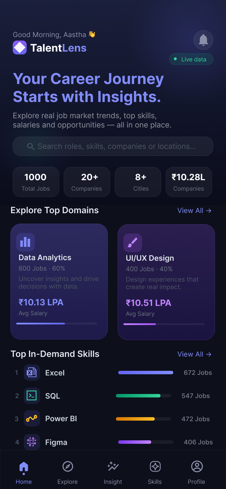
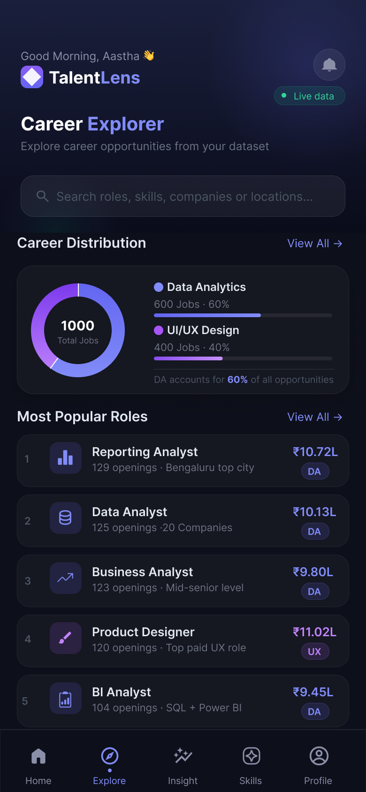
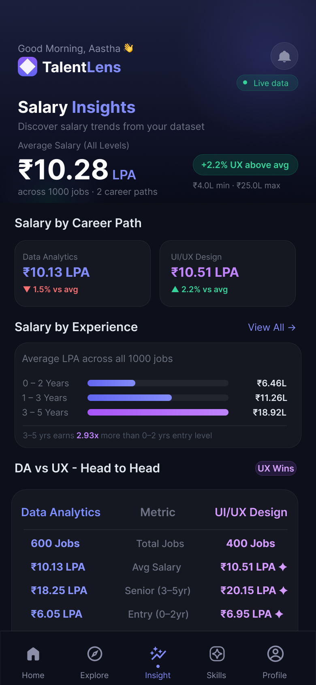
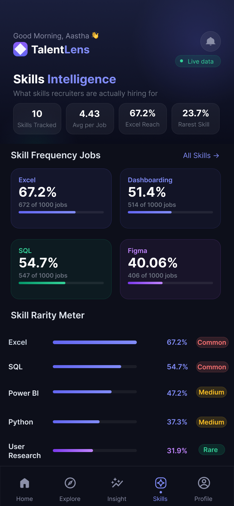
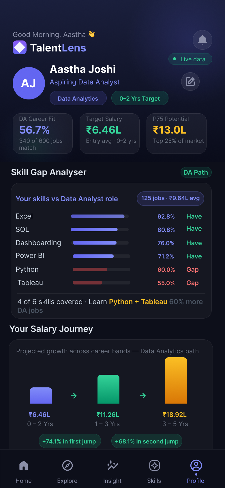
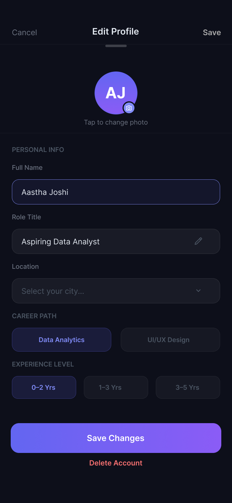

<div align="center">

# 🎯 TalentLens India
### Career Intelligence Dashboard — Data Analytics vs. UI/UX Design (2026)

**Helping fresh graduates choose the right tech career using real job-market data.**

[](./TalentLens_Analysis.xlsx)
[](./sql_queries.sql)
[](./Screenshots/)
[](YOUR-FIGMA-PROTOTYPE-LINK)
[](YOUR-FIGMA-PROTOTYPE-LINK)

*Built by **Aastha Joshi** · B.E. CSE (Cloud Computing) · Chandigarh University · June 2026*

</div>

---

## 🔗 Quick Links

| Resource | Link |
|---|---|
| 📱 **Interactive Figma Prototype** | [Open live prototype →](https://www.figma.com/proto/WUD9EAkXc0N0lHpNsPUifM/Talentlens?t=IT8rpJ1eJOj0yRSe-1&scaling=scale-down&content-scaling=fixed&page-id=0%3A1&node-id=1-2&starting-point-node-id=1%3A2) |
| 🗄️ **SQL Queries (30+ queries)** | [sql_queries.sql](./sql_queries.sql) |
| 📊 **Dataset (1,000 rows)** | [talentlens_1000.csv](./talentlens_1000.csv) |
| 📈 **Excel Analysis** | [TalentLens_Analysis.xlsx](./TalentLens_Analysis.xlsx) |
| 🖼️ **Power BI Screenshots** | [/Screenshots](./Screenshots/) |
| 📱 **Figma App Screens** | [/figma-screens](./figma-screens/) |

---

## 📌 Overview

**TalentLens India** is an end-to-end career intelligence project that analyses **1,000 real-style tech job postings** across India to answer one practical question every fresh graduate asks:

> *"Should I become a Data Analyst or a UI/UX Designer?"*

The project takes a single dataset through **four different tools** — SQL, Excel, Power BI, and Figma — each adding a new layer of insight, culminating in a fully designed **mobile app concept** that puts career intelligence in a job-seeker's pocket.

This is not just a dashboard. It is a **complete data product**:

```
Raw Data  →  Query Layer  →  Analysis Layer  →  BI Layer  →  End-User Product
  CSV           SQL              Excel           Power BI        Figma App
```

---

## 🧩 The Problem

Fresh graduates in India's tech industry face a recurring dilemma — **Data Analytics or UI/UX Design?** — but rarely have access to consolidated, data-backed answers about:

- Which path pays more, and at what experience level
- Which skills are *actually* required (not just listed on job boards)
- Which cities and companies hire freshers most aggressively
- How salary realistically grows over a 5-year career arc

**TalentLens solves this by turning 1,000 job postings into a decision-making tool.**

---

## 🗂️ Dataset

| Attribute | Detail |
|---|---|
| **Records** | 1,000 job postings |
| **Career Paths** | Data Analytics (600 · 60%) · UI/UX Design (400 · 40%) |
| **Companies** | 20 active recruiters — Accenture, Infosys, EY, KPMG, TCS, Flipkart, Swiggy, Groww, Razorpay, Amazon India, Deloitte, PwC, Meesho, Zomato, Paytm, PhonePe, CRED, IBM, Cognizant, Genpact |
| **Cities** | 8 — Bengaluru, Hyderabad, Pune, Gurugram, Mumbai, Chennai, Noida, Delhi |
| **Job Roles** | 10 distinct titles — Data Analyst, Reporting Analyst, BI Analyst, Analytics Associate, Business Analyst, UX Designer, Product Designer, UX Researcher, UI/UX Designer, UI Designer |
| **Experience Bands** | 0–2 Yrs · 1–3 Yrs · 3–5 Yrs |
| **Skill Flags** | SQL, Excel, Power BI, Python, Tableau, Statistics, Dashboarding, Figma, Wireframing, User Research |
| **Salary Field** | `Salary_LPA` — Lakhs Per Annum (range: Rs.4.0L – Rs.25.0L) |

---

## 🛠️ Tech Stack & Workflow

```
   CSV Data (1,000 jobs)
          │
          ▼
   ┌─────────────┐      ┌──────────────┐      ┌──────────────┐      ┌──────────────┐
   │     SQL     │ ───▶ │    Excel     │ ───▶ │   Power BI   │ ───▶ │    Figma     │
   │ 30+ Queries │      │ Pivots+Charts│      │ 4-Page Report│      │ Mobile App UI│
   └─────────────┘      └──────────────┘      └──────────────┘      └──────────────┘
   Pattern mining       Manual validation     Interactive BI        Consumer product
```

| Tool | Role in the Project |
|---|---|
| 🗃️ **SQL (MySQL)** | 30+ queries using CTEs, window functions (`RANK`, `DENSE_RANK`, `LAG`, `NTILE`, `PERCENT_RANK`), subqueries, and `CASE` statements to mine salary patterns, skill demand, and career fit scores |
| 📊 **Excel** | 5 pivot tables and 6 charts to validate SQL findings; one-page executive summary with key findings and recommendations |
| 📈 **Power BI** | 4-page interactive dashboard (Overview · Skills Intelligence · Salary Intelligence · Career Recommendations) with DAX measures and 4 cross-filter slicers |
| 🎨 **Figma** | 6-screen dark-themed mobile app (390×844 px) with 28 prototype connections — all data displayed in the app is verified against the actual dataset |

---

## 🔑 Key Findings

| # | Insight |
|---|---|
| 1️⃣ | **UI/UX Design pays more at every experience level** — Rs.10.51 LPA vs Rs.10.13 LPA on average; the gap widens from +Rs.0.9 LPA at fresher level to +Rs.1.9 LPA at senior level |
| 2️⃣ | **Excel (67%) and SQL (55%)** are the most in-demand skills overall — near-mandatory for Data Analytics (Excel 91%, SQL 85%) |
| 3️⃣ | **Bengaluru dominates hiring** with 259 of 1,000 jobs (26%) — nearly 1.5x the next closest city, Hyderabad (185) |
| 4️⃣ | **Figma (97%) and Wireframing (89%)** are must-have skills for UI/UX — skill sets for the two paths are almost completely mutually exclusive |
| 5️⃣ | **Accenture and Infosys** lead Data Analytics fresher hiring (74 and 70 total openings); **Groww** leads UI/UX fresher hiring (31 openings) |
| 6️⃣ | **Salary triples across a career** — Data Analytics grows from Rs.6.1 LPA (entry) to Rs.18.2 LPA (senior); UI/UX follows the same trajectory at a higher curve (Rs.7.0 → Rs.20.1 LPA) |
| 7️⃣ | The **median job pays Rs.8.6 LPA**, while the top 10% of postings clear Rs.18.5+ LPA — a wide spread driven almost entirely by experience, not career path |
| 8️⃣ | **Figma is the only skill that boosts salary** when required (Rs.10.44L with Figma vs Rs.10.18L without) — SQL and Python correlate with lower averages due to entry-level overlap |
| 9️⃣ | **Pune has the highest average salary** at Rs.10.83 LPA, ahead of Gurugram (Rs.10.46L) and Bengaluru (Rs.10.33L) — despite Bengaluru having the most jobs |

---

## 📊 Power BI Dashboard — 4 Pages

| Page | What it shows |
|---|---|
| **1. Overview** | Market snapshot — total jobs, average salary, hiring demand by city, career path donut chart, top companies, top skills in demand |
| **2. Skills Intelligence** | Skill distribution by career path, tool popularity heatmap, top skill combinations (SQL + Excel = 475 jobs), city-level skill demand |
| **3. Salary Intelligence** | Salary by city, career path, and experience; salary distribution chart; top-paying companies; key salary insights |
| **4. Career Recommendations** | "Who should choose which path" decision guide, learning roadmaps for each track, side-by-side career comparison table |

Every page is fully interactive with **slicers for Career Path, City, Experience Level, and Company**.

| Overview | Skills Intelligence |
|---|---|
|  |  |

| Salary Intelligence | Career Recommendations |
|---|---|
|  |  |

---

## 📱 TalentLens Mobile App — Figma Concept

A 6-screen mobile app concept that translates the dataset into a personalised career-guidance product.

| Screen | Purpose |
|---|---|
| 🏠 **Home** | Personalised greeting, top-line market stats, top domains, in-demand skills with proportional bars |
| 🧭 **Explorer** | Career distribution donut chart, most popular roles ranked by openings, career path experience breakdown |
| 💰 **Insight** | Salary by career path, 3-band experience chart, DA vs UX head-to-head comparison, top salary cities |
| ⚡ **Skills** | Skill frequency grid (%), salary impact of each skill, power skill combo cards, rarity meter (Common / Medium / Rare) |
| 👤 **Profile** | Career fit score (56.7% DA match), salary journey chart, top companies hiring, salary percentile position (P25/P50/P75/P90) |
| ✏️ **Edit Profile** | Editable name, role, location, career path toggle, experience selector, skill on/off toggles |

The **Skills Intelligence** and **Profile** screens are the centrepieces — they cross-reference a user's actual skills against live market demand and show exactly which gaps to close (e.g. *"Learn Python + Tableau → unlock 60% more DA jobs"*).

<table>
<tr>
<td align="center"><br/><b>Home</b></td>
<td align="center"><br/><b>Explorer</b></td>
<td align="center"><br/><b>Insight</b></td>
<td align="center"><br/><b>Skills</b></td>
<td align="center"><br/><b>Profile</b></td>
<td align="center"><br/><b>Edit Profile</b></td>
</tr>
</table>

🔗 **[Open the live interactive prototype →]([YOUR-FIGMA-PROTOTYPE-LINK](https://www.figma.com/proto/WUD9EAkXc0N0lHpNsPUifM/Talentlens?t=IT8rpJ1eJOj0yRSe-1&scaling=scale-down&content-scaling=fixed&page-id=0%3A1&node-id=1-2&starting-point-node-id=1%3A2))**

---

## 🗃️ SQL Highlights

30+ queries across 10 sections — from basic aggregation to advanced analytics:

```sql
-- Career fit score: match a user's skillset against live job demand
WITH user_skills AS (
    SELECT 1 AS SQL_Skill, 1 AS Excel, 1 AS PowerBI,
           0 AS Python,    0 AS Figma
),
matching_jobs AS (
    SELECT
        j.Job_ID, j.Job_Title, j.Career_Path, j.Salary_LPA,
        (j.SQL_Skill * u.SQL_Skill +
         j.Excel     * u.Excel     +
         j.PowerBI   * u.PowerBI)   AS Skills_Matched
    FROM jobs j CROSS JOIN user_skills u
    WHERE j.Career_Path = 'Data Analytics'
)
SELECT
    Job_Title,
    COUNT(*)                  AS Matching_Jobs,
    ROUND(AVG(Salary_LPA), 2) AS Avg_Salary,
    ROUND(COUNT(*) * 100.0 /
        (SELECT COUNT(*) FROM jobs
         WHERE Career_Path = 'Data Analytics'), 1) AS Match_Pct
FROM matching_jobs
WHERE Skills_Matched >= 2
GROUP BY Job_Title
ORDER BY Matching_Jobs DESC;
```

**Techniques demonstrated:**
- ✅ `GROUP BY`, `HAVING`, `ORDER BY`, `LIMIT`
- ✅ `RANK()`, `DENSE_RANK()`, `NTILE()`, `PERCENT_RANK()` window functions
- ✅ `LAG()` for period-over-period salary growth analysis
- ✅ CTEs (`WITH`) for layered, readable logic
- ✅ Salary percentile analysis (P25 / P50 / P75 / P90) via subqueries
- ✅ Conditional aggregation (`CASE WHEN`) for skill-pair and salary comparisons
- ✅ `UNION ALL` for multi-skill demand comparison in a single result set

📁 Full query file: [`sql_queries.sql`](./sql_queries.sql)

---

## 📈 Excel Analysis

| Sheet | Contents |
|---|---|
| `Executive_Summary` | One-page project brief — findings, tools used, recommendations |
| `PT1_Salary` | Average salary by career path & experience (pivot + line chart) |
| `PT2_Skills` | Skill demand comparison DA vs UI/UX (pivot + horizontal bar chart) |
| `PT3_Cities` | Job count and average salary by city (pivot + bar chart) |
| `PT4_Companies` | Top hiring companies by career path (pivot + bar chart) |
| `Charts` | Consolidated chart gallery |

📁 [`TalentLens_Analysis.xlsx`](./TalentLens_Analysis.xlsx)

---

## 🏆 My Recommendation

| If you... | Choose |
|---|---|
| Enjoy numbers, patterns, and logic-driven problem solving | **Data Analytics** |
| Enjoy creative, visual, and human-centred problem solving | **UI/UX Design** |
| Want maximum job availability (60% market share) | **Data Analytics** |
| Want slightly higher earning potential at every level | **UI/UX Design** |
| Are targeting Accenture, Infosys, TCS, EY, Deloitte | **Data Analytics** |
| Are targeting CRED, Flipkart, Groww, Razorpay, Zomato | **UI/UX Design** |
| Want to maximise job options in one city | **Bengaluru — best for both paths** |

---

## 📂 Repository Structure

```
TalentLens-India/
│
├── README.md                        ← you are here
├── talentlens_1000.csv              ← master dataset (1,000 jobs)
├── sql_queries.sql                  ← 30+ SQL queries across 10 sections
├── TalentLens_Analysis.xlsx         ← Excel pivot analysis + executive summary
│
├── Screenshots/                     ← Power BI dashboard exports (4 pages)
│   ├── 01_overview.png
│   ├── 02_skills.png
│   ├── 03_salary.png
│   └── 04_career.png
│
└── figma-screens/                   ← Figma mobile app screens (6 screens)
    ├── 01_home.png
    ├── 02_explore.png
    ├── 03_insight.png
    ├── 04_skills.png
    ├── 05_profile.png
    └── 06_edit_profile.png
```

---

## 🚀 How to Explore This Project

| Step | Action |
|---|---|
| 1️⃣ | **Start with the data** → [`talentlens_1000.csv`](./talentlens_1000.csv) |
| 2️⃣ | **See the queries that mined it** → [`sql_queries.sql`](./sql_queries.sql) |
| 3️⃣ | **See it validated and charted in Excel** → [`TalentLens_Analysis.xlsx`](./TalentLens_Analysis.xlsx) |
| 4️⃣ | **See it as a live filterable dashboard** → Power BI screenshots in [`/Screenshots`](./Screenshots/) |
| 5️⃣ | **See it as a real consumer product** → Figma mobile app in [`/figma-screens`](./figma-screens/) |
| 6️⃣ | **Interact with it live** → [Open Figma Prototype](https://www.figma.com/proto/WUD9EAkXc0N0lHpNsPUifM/TalentLens?node-id=1-2&starting-point-node-id=1%3A2&t=IT8rpJ1eJOj0yRSe-1&scaling=scale-down&content-scaling=fixed&page-id=0%3A1) | 

---

## 🧑‍💻 About the Author

**Aastha Joshi**
B.E. CSE (Cloud Computing) · Chandigarh University · CGPA 7.61
*Aspiring Data Analyst · Career Path: Data Analytics*

| | |
|---|---|
| 📧 Email | aasthajoshi890@gmail.com |
| 🐙 GitHub | [github.com/trewilljo)](https://github.com/trewilljo) |
| 💼 LinkedIn | [linkedin.com/in/aasthajoshi3](https://linkedin.com/in/aasthajoshi3) |
---

<div align="center">

*TalentLens India © 2026 — Empowering Careers with Data Insights*
*Built with Excel · SQL · Power BI · Figma*

**⭐ If this project helped clarify a career decision, consider giving it a star!**

</div>
